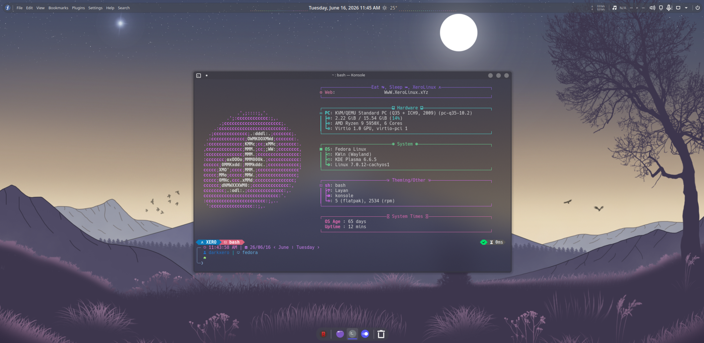

# FedInstall

Turn a fresh **Fedora** install into a ready-to-use **KDE Plasma** desktop, one command one outcome.



## Run it

Install **Base Fedora** using the [**Fedora Everything**](https://fedoraproject.org/misc/#everything) ISO. Just select locale, create user and set password, select Drive to install system on, enable & set root password (Optional), now hit next and watch it do its thing. Once it's done reboot and you will be on the TTY, login and run the following command :

```bash
curl -fsSL https://urls.xerolinux.xyz/XeroDora | bash
```

Important Note :

> Use wired Internet as Fedora doesn't offer many WiFI drivers out the box post-base install. Not a Xero issue but a Fedora one. If you can't use Ethernet, try USB-Thethering. With that in mind install should go smoothly.

## What you get

- RPMFusion (free + nonfree) + Flathub + Terra
- KDE Plasma desktop (vanilla, Breeze Dark by default)
- Faster dnf (10 parallel downloads, fastest mirrors)
- Multimedia codecs that just work
- A handy set of apps & tools tools
- An optional menu to pick extra apps
- Plasma Login Manager + fastfetch on terminal start
- Optional XeroLinux Rice install menu

## Optional apps

During the run you get a numbered menu. Type the numbers you want (space-separated), or just press Enter to skip. Tags:

- *(no tag)* — installed from Fedora / RPMFusion
- `[R]` — official vendor repo (Brave, Vivaldi, LibreWolf, VSCodium)
- `[F]` — Flatpak from Flathub

When done, reboot:

```bash
sudo systemctl reboot
```
